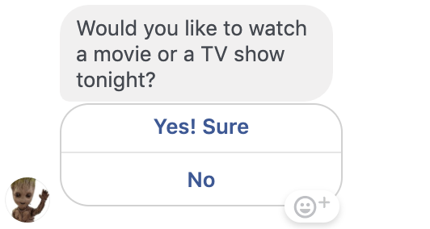
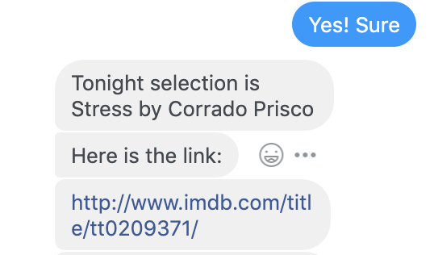
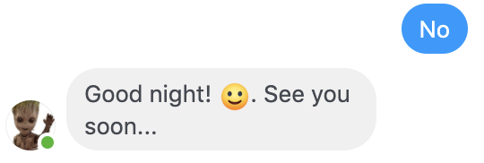
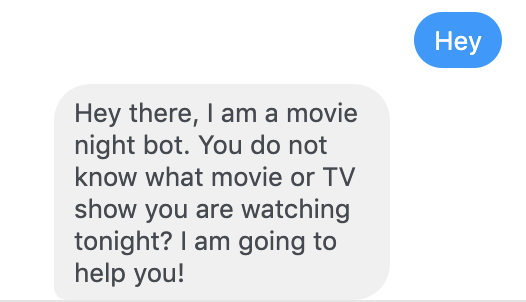
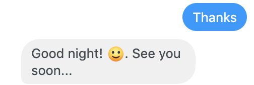
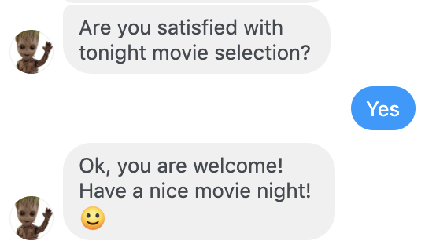
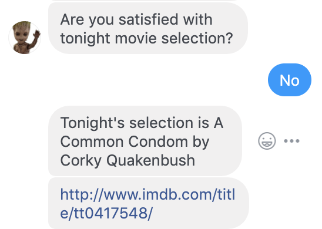
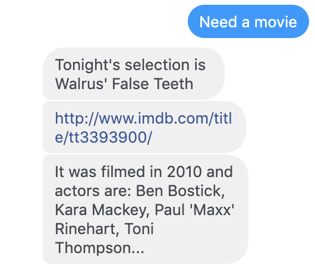

# Movie night chatbot

You do not know what movie or TV show you are watching tonight? `Movie night chatbot` will help you!

It greets you, randomly selects a movie or TV show for you from [imdb](https://www.imdb.com/) 
and you will have a great movie night without selecting movie for quite long time! Just that simple.

Facebook messenger app based on `Node.js` and [BootBot](https://github.com/Charca/bootbot/blob/master/README.md) library.

## Features
- Starts **conversation** with introduction message and initial buttons choice
- Gets random `movi` or `TV show` from  [imdb](https://www.imdb.com/) and shows you basic information if react positively to initial decision
- Chooses another movie for you if you are not satisfied with the selection or if you type `"movie"`
- Response to the `hello, hi, good morning`... greetings
- Response to the `goodbye, by, see you` and `thanks, thank you` ... 

## Usage

### 1 initial decision

`Positive:` Selects a movie for you.
\

\
`Negative:` Greets you good night.
\

### 2 greetings

`Hello:` Says hi back and asks if you want to watch something.
\

\
`Bye/Thanks:` Greets you good night.
\

### 3 Reaction to movie

`Positive:` Selects another movie for you.
\

\
`Negative:` Greets you good night.
\

### When you come back again for a new movie

You can type anything which contains word `movie`. For example:

